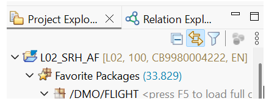

# Unit 4 – Supplementary Lesson 1 - Create your own table and insert data 

## Activate the “link with editor” feature

Click on the two yellow arrows  at the top of the project explorer:


 
## Create your own table 

Copy table `/DMO/CONNECTION` and create a new table `ZCONNECTION_##`
1.	Right click on table `/DMO/CONNECTION`
2.	Choose **Duplicate**
3.	Enter  
    a.	Name: `ZCONNECTION_###`  
    b.	Package: Your package , e.g. `S4D400_SRH_ST_###`
4.	Press **Next**
5.	Press **Finish**

## Create a new class to enter data into your z-table   

1.	Create a class `ZCL_INSERT_DATA_###` that implements the interface `if_oo_adt_classrun`
2.	In the `main` method add the following code

Hint you can ask Joule using the following prompt

“Create a value statement for some data for Zconnection_##”
DATA lt_connections TYPE TABLE OF zconnection_afi.

```ABAP
lt_connections = VALUE #(  
  ( client           = '100'
    carrier_id       = 'LH'
    connection_id    = '0001'
    airport_from_id  = 'FRA'
    airport_to_id    = 'JFK'
    departure_time   = '080000'
    arrival_time     = '110000'
    distance         = 6200
    distance_unit    = 'MI' )
  ( client           = '100'
    carrier_id       = 'UA'
    connection_id    = '0002'
    airport_from_id  = 'ORD'
    airport_to_id    = 'LHR'
    departure_time   = '090000'
    arrival_time     = '110000'
    distance         = 3950
    distance_unit    = 'MI' )
  ( client           = '100'
    carrier_id       = 'SQ'
    connection_id    = '0003'
    airport_from_id  = 'SIN'
    airport_to_id    = 'SYD'
    departure_time   = '220000'
    arrival_time     = '080000'
    distance         = 3900
    distance_unit    = 'KM' )
).

modiFY zconnection_afi FROM TABLE @lt_connections. 

COMMIT WORK. 

out->write( sy-dbcnt ).
```
 
Retrieve more demo data as value statement from `/dmo/connection`

1.	Press **Ctrl+Shift+A** to open the table `/dmo/connection`
2.	Press **F8** to start the data preview
3.	Right click on the result and select **Copy all rows as** and then **ABAP VALUE STATEMENT** 
4.	Copy the source code into your class

