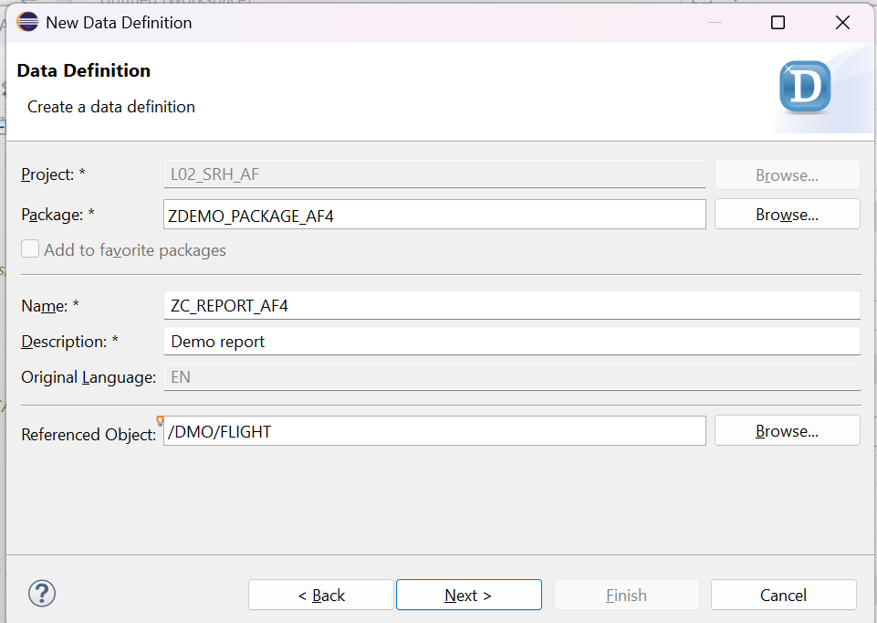
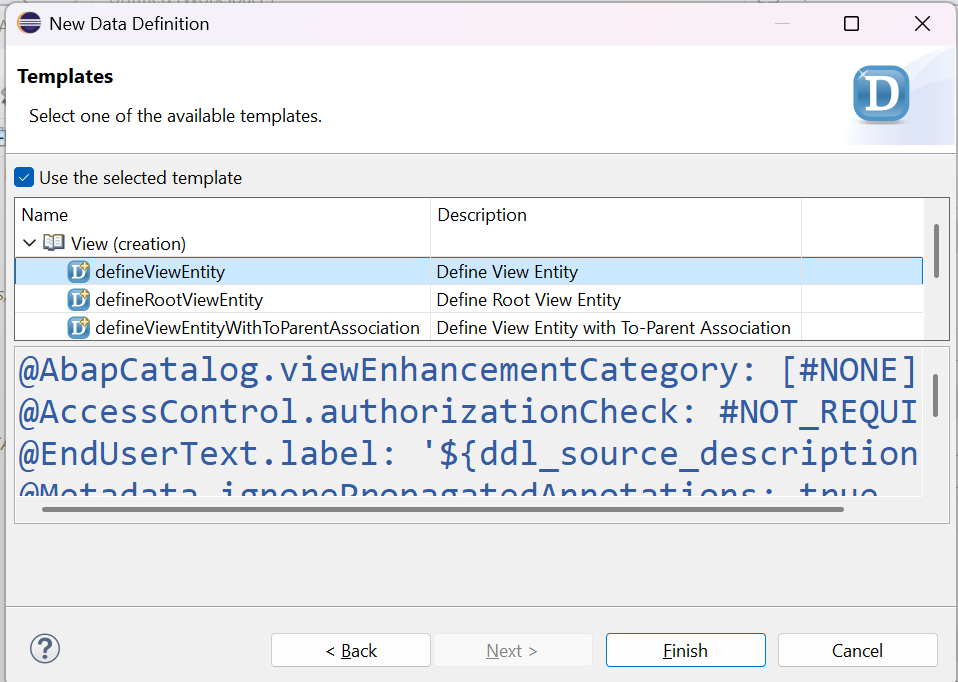
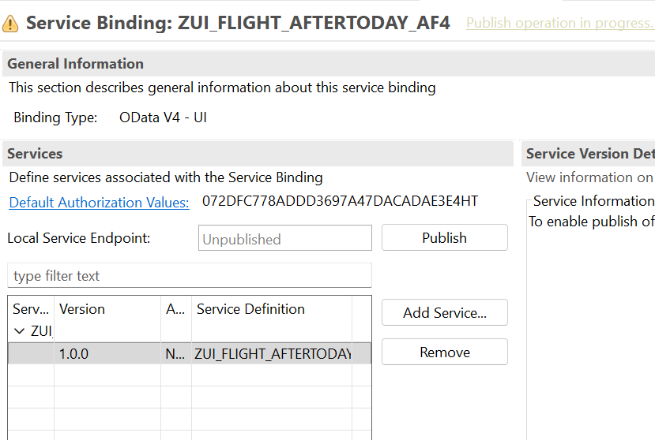
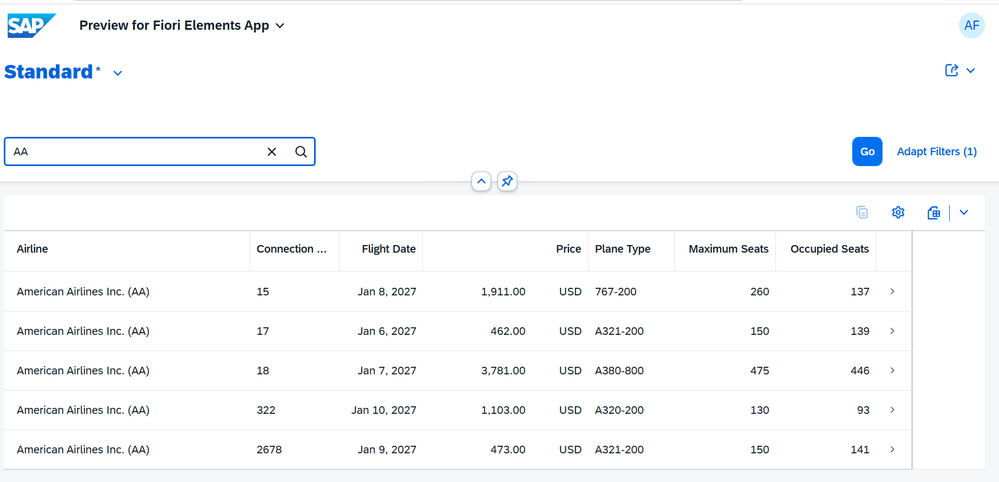

# How to create a read-only "report"

## Create a CDS view

1. Right-click on the package and select **New** > **Other ABAP Repository Object** > **Core Data Services** > **Data Definition**.

    

2. Enter the following values:

   | Field | Value |
   |---|---|
   | Name              | **`Z_Flight_Aftertoday_###`** |
   | Description       | **`Demo report`** |
   | Referenced Object | **`/dmo/flight`** |   
   | Package           | **`<your_package>`** |

    

3. Click **Next >** to continue, select a transport request if requested, click **Next >** to continue, select the template **`DefineViewEntity`** under **View (creations)** in the tree, and confirm with **Finish**.

   

4. Replace the code with the following coding

```ABAP
@EndUserText.label: 'Flights with Flight Date Later Than Two Days From Today'
@Search.searchable: true

define view entity Z_Flight_Aftertoday_###

  as select from /dmo/flight as Flight

  association [1] to /DMO/I_Carrier as _Airline on $projection.AirlineID = _Airline.AirlineID


{
      @UI.lineItem: [ { position: 10, label: 'Airline'} ]
      @Search.defaultSearchElement: true
      @Search.fuzzinessThreshold: 0.7
      @ObjectModel.text.association: '_Airline'
  key Flight.carrier_id     as AirlineID,

      @UI.lineItem: [ { position: 20, label: 'Connection Number' } ]
  key Flight.connection_id  as ConnectionID,

      @UI.lineItem: [ { position: 30, label: 'Flight Date' } ]
  key Flight.flight_date    as FlightDate,

      @UI.lineItem: [ { position: 40, label: 'Price' } ]
      @Semantics.amount.currencyCode: 'CurrencyCode'
      Flight.price          as Price,

      Flight.currency_code  as CurrencyCode,

      @UI.lineItem: [ { position: 50, label: 'Plane Type' } ]
      @Search.defaultSearchElement: true
      @Search.fuzzinessThreshold: 0.7
      Flight.plane_type_id  as PlaneType,

      @UI.lineItem: [ { position: 60, label: 'Maximum Seats' } ]
      Flight.seats_max      as MaximumSeats,

      @UI.lineItem: [ { position: 70, label: 'Occupied Seats' } ]
      Flight.seats_occupied as OccupiedSeats,

      /* Associations */
      _Airline
}
where
  Flight.flight_date > $session.user_date

```

5. Save and activate your coding

## Create a service definition

1. Right-click on the package and select **New** > **Other ABAP Repository Object** > **Service Definition**.

2. Enter the following values:

   | Field | Value |
   |---|---|
   | Name              | **`ZUI_Flight_Aftertoday_###`** |
   | Description       | **`Demo report`** |
   | Source Type        | **`Definition`** |
   | Referenced Object | **`Z_Flight_Aftertoday_###`** |   
   | Package           | **`<your_package>`** |

Press Next several times and then finish

3. Add an alias `FlightsAfterToday` so that the source code now reads

```ABAP
@EndUserText.label: 'Demo report'
define service ZUI_Flight_Aftertoday_###
{
    expose Z_FLIGHT_AFTER2DAYS_### as FlightsAfterToday;
    
}

```
   

4. Save and Activate your changes.


## Create a service binding

1. Right click on the service definition that you have just created and select **New Service Binding**.

2. Enter the following values:

   | Field | Value |
   |---|---|
   | Name              | **`ZUI_Flight_Aftertoday_###`** |
   | Description       | **`Demo report`** |
   | Binding Type        | **`OData V4 - UI`** |
   | Service Definition | **`ZUI_FLIGHT_AFTERTODAY_###`**|
   | Package           | **`<your_package>`** |

   and press **Next** and then **Finish**

 3. Activate the object

    

 4. Press **Publish Locally**

 5. Test the service

    You will get a report that shows the flights after the current date and you are able to search for the airline name, e.g. `AA`.    

    


