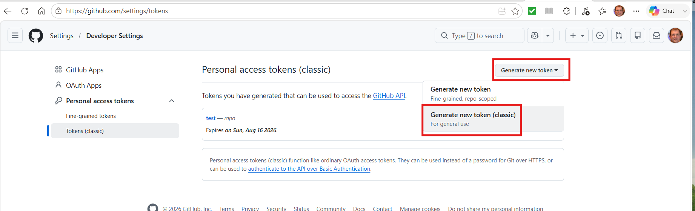
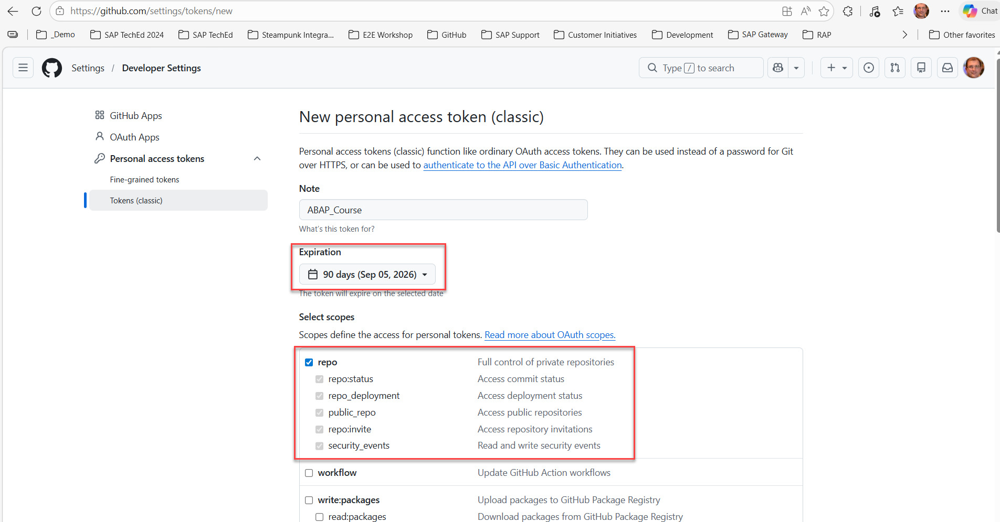
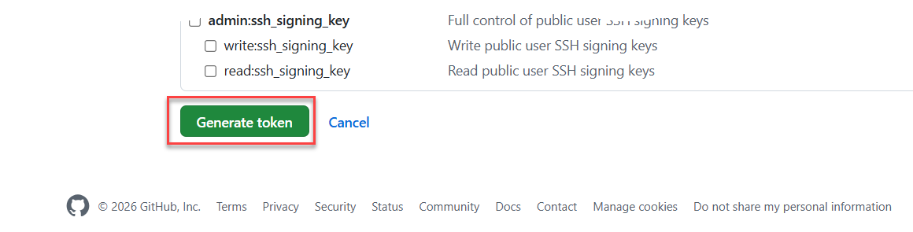
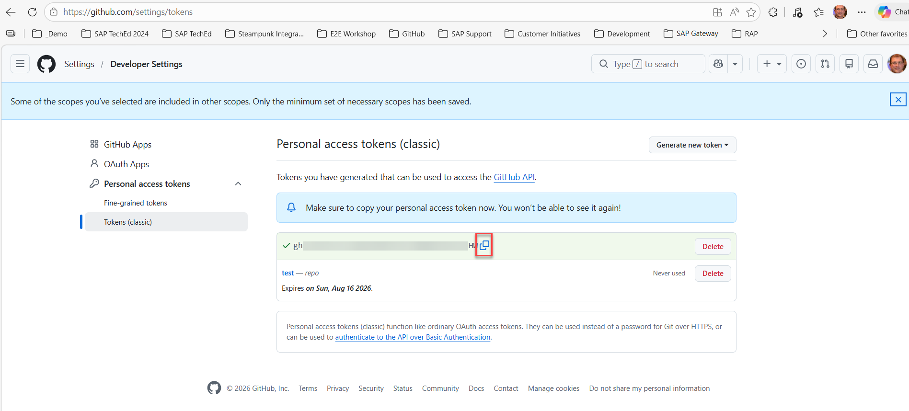

# How to create a personal access token

> When linking your Github repository with your package in the SAP BTP, ABAP Environment system you are being asked for credentials. Here you have to enter your Github user name and as a password a personal access token. How to create such a token is described in the following:

1. Open the following link in Github https://github.com/settings/tokens.   
2. Click on the **Generate Token** button and select **Generate new token (classic)**. 
   
  
3. Enter the following data:
   - In the field **Note** enter a meaningful name (e.g. ABAP_Course)  
   - Select an experation (e.g. 90 days)
   - As the scope it is sufficient to select the checkbox `repo`.  

       

4. Scroll down to the end and press the **Generate** button.  
     
5. Copy the token and save it for later use.  
   ⚠️ The token will not be shown a second time. So if you forget to copy it you have to generate a new token.  

     