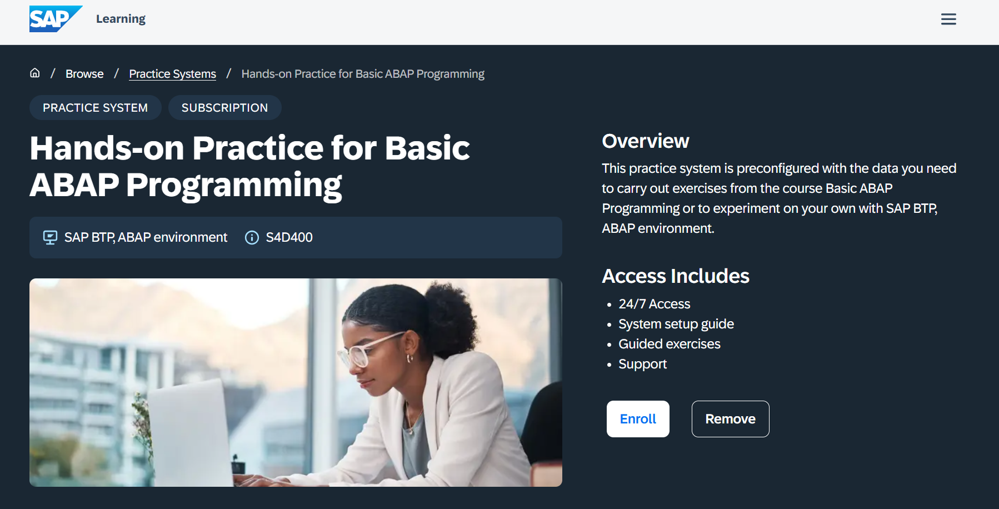
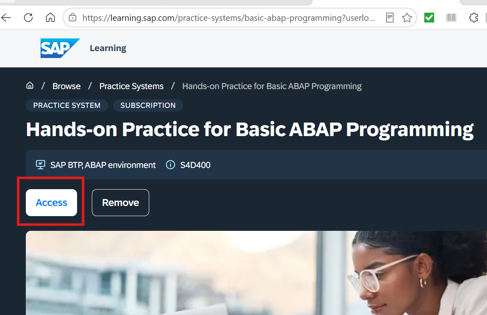

In the following the steps to access the learning hub training system are described.

It is especially mentioned when (that means how many days / weeks / immediately) these steps have to be performed.

You can skip those steps you have already performed.

# Immediately

## 1. Apply for an SAP Universal ID

If you have not applied for an SAP Universal ID, please perform step 1 "Creating your SAP Universal ID (UID)"  as described in the blog post:

[Free SAP Certification and practice systems for students & lecturers](https://community.sap.com/t5/beginner-corner-blog-posts/free-sap-certification-and-practice-systems-for-students-amp-lecturers/ba-p/14052493) 

This step does not take long and you can immediately start with step 2 afterwards.

## 2. Register for the free SAP Learning Hub, Student Edition

After having created the SAP Universal ID, which only takes a few minutes, you have in addition to register for the free SAP Learning Hub, Student Edition.  

⚠️ This is a two-step process that can takes up to 72h 

- In a first step your student status will be checked by the external service provider SheerID.
- After this verfication took place you in addition have to wait for the activation e-mail from SAP
See step 2 "Verify yourself as a student (or faculty)" in the following blog post 

[Free SAP Certification and practice systems for students & lecturers](https://community.sap.com/t5/beginner-corner-blog-posts/free-sap-certification-and-practice-systems-for-students-amp-lecturers/ba-p/14052493)  

So you should start the registration process for the SAP Learning Hub immediately after having received your SAP Universal ID.

# The week before the lecture (class-room-training) starts

🔔 Please note that the user in the training system is onlv valid up to 21 days.  

Since on the other hand it takes up to 24 hours to get the user created in the backend the enrollment in the practice system should take place in the week b

## 3. Get a user in the practice system

This step is also mandatory.

In this last step you must enroll for a user in the SAP BTP ABAP Environment Practice System that we are going to use.

However,in order to perform it you have have to performed step 1 (Get a universal SAP ID) and step 2 (Register for the free SAP Learning Hub, Student Edition) mentioned above. 

- Click on [Hands-on Practice System for Basic ABAP Programming](https://learning.sap.com/practice-systems/basic-abap-programming)
- Click on **Enroll**   

  

- Click on **Access** and note down your **group number**  
  
  

- When clicking **Access** you will log on to the SAP Fiori Launchpad of the practice system so that you can retrieve its URL from the browser.  
  

