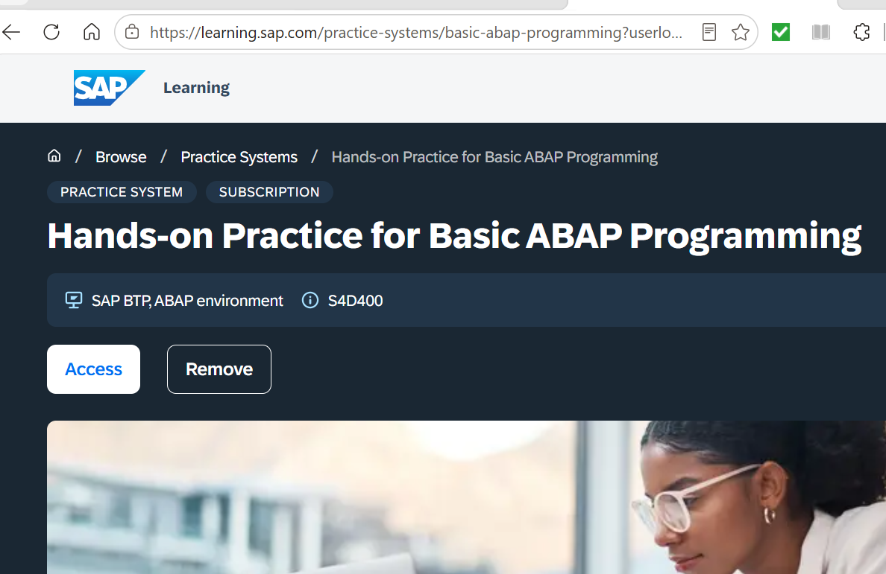
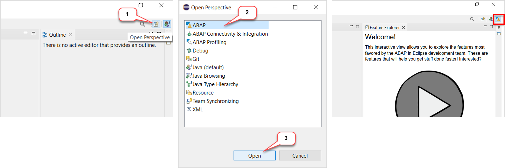
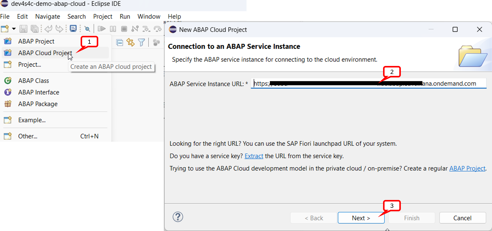
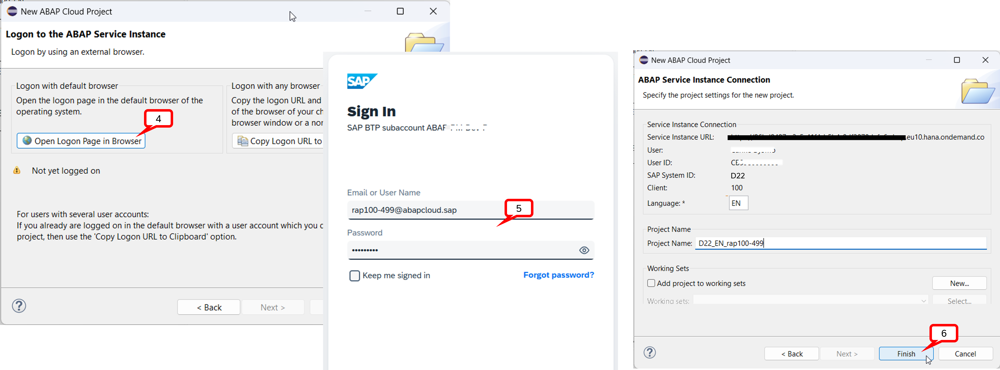

 # How to create an ABAP Cloud Project

[^Top of page](#)

> Create an _**ABAP Cloud Project**_ in your ADT installation to connect it to the *SAP BTP ABAP Environment* system.
>

1. Log on to the practice system to retrieve the logon URL and click on **Access**.  

   [Hands-on Practice System for Basic ABAP Programming](https://learning.sap.com/practice-systems/basic-abap-programming)

    

   Copy the URL from the adress bar from your browser. 
   
1. Open the **ABAP** perspective if not yet done.

    

2. Now create the _**ABAP Cloud Project**_ as shown on the screenshots provided below. 

     

     

